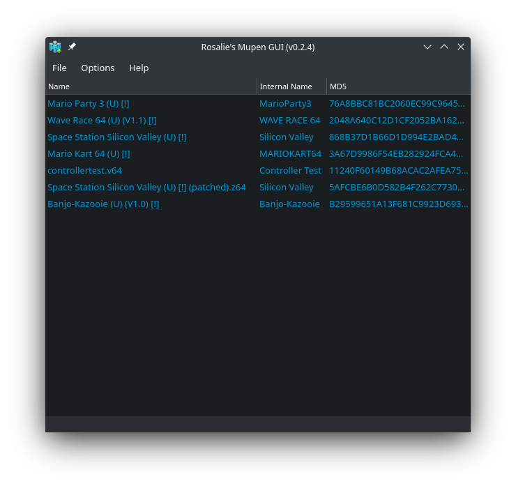
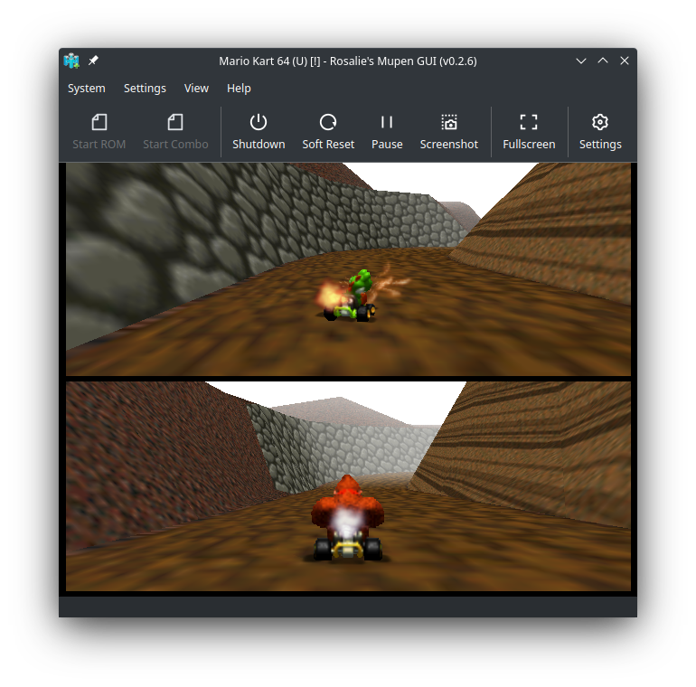
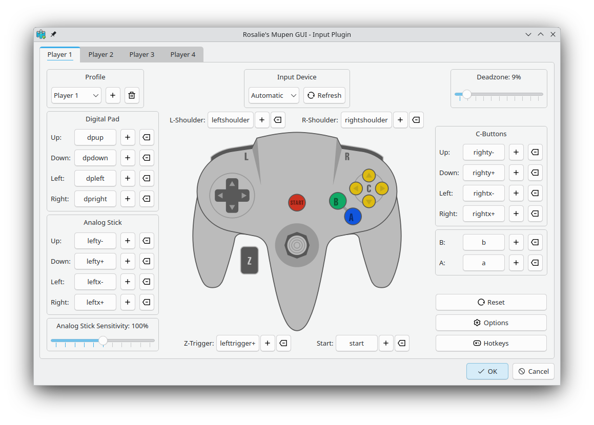

# Rosalie's Mupen GUI

Rosalie's Mupen GUI is a free and open-source mupen64plus GUI written in C++.

It offers a simple-to-use user interface.

## Support

Join the [Rosalie's Mupen GUI Discord Server](https://discord.gg/k9GuyJ2PpF) for support

## License

Rosalie's Mupen GUI is licensed under the [GNU General Public License v3.0](https://www.gnu.org/licenses/gpl-3.0.en.html).

## Showcase





## Building

#### Linux
* Portable Debian/Ubuntu

  ```bash
  sudo apt-get -y install cmake libhidapi-dev libsamplerate0-dev libspeex-dev libminizip-dev libsdl2-dev libfreetype6-dev libgl1-mesa-dev libglu1-mesa-dev pkg-config zlib1g-dev binutils-dev libspeexdsp-dev qt6-base-dev libqt6svg6-dev build-essential nasm git zip
  ./Source/Script/Build.sh Release
  ```
  
* Portable Fedora
  ```bash
  sudo dnf install hidapi-devel libsamplerate-devel minizip-compat-devel SDL2-devel freetype-devel mesa-libGL-devel mesa-libGLU-devel zlib-ng-devel binutils-devel speexdsp-devel qt6-qtbase-devel qt6-qtsvg-devel gcc-c++ nasm git
  ./Source/Script/Build.sh Release
  ```

When it's done building, executables can be found in `Bin/Release`

* Installation/Packaging
```bash
mkdir build && cd build
cmake .. -DCMAKE_BUILD_TYPE="Release" -DPORTABLE_INSTALL="OFF" -G "Unix Makefiles"
make install
```

#### Windows
* Download & Install [MSYS2](https://www.msys2.org/)
```bash
pacman -S --needed make mingw-w64-x86_64-cmake mingw-w64-x86_64-gcc mingw-w64-x86_64-hidapi mingw-w64-x86_64-freetype mingw-w64-x86_64-libpng mingw-w64-x86_64-SDL2 mingw-w64-x86_64-qt6 mingw-w64-x86_64-SDL2 mingw-w64-x86_64-hidapi mingw-w64-x86_64-speexdsp mingw-w64-x86_64-libsamplerate mingw-w64-x86_64-nasm mingw-w64-x86_64-minizip git
./Source/Script/Build.sh Release
```

When it's done building, executables can be found in `Bin/Release`
