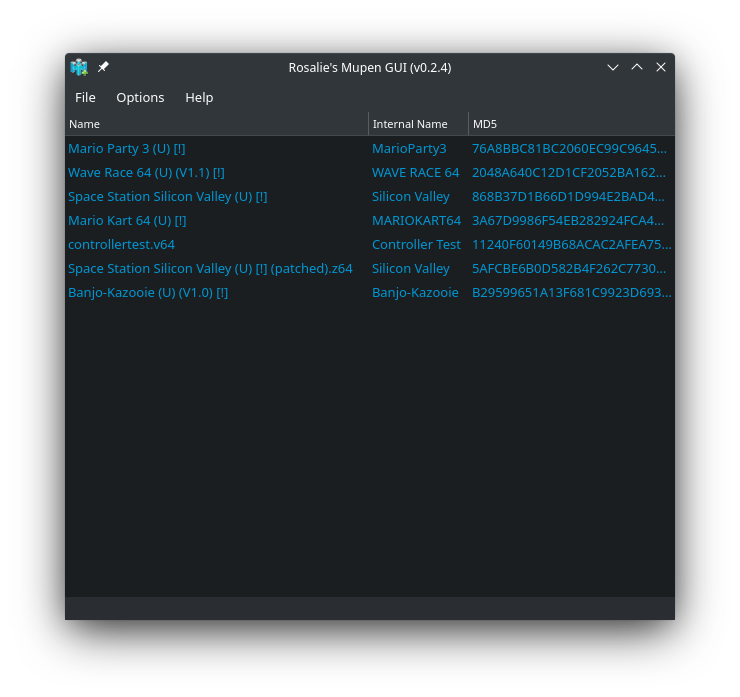
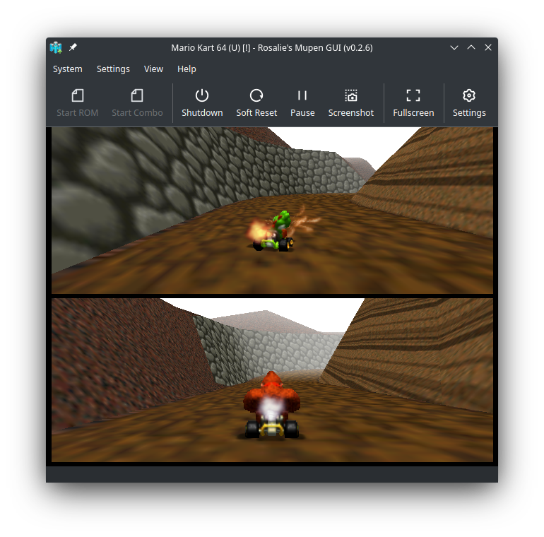
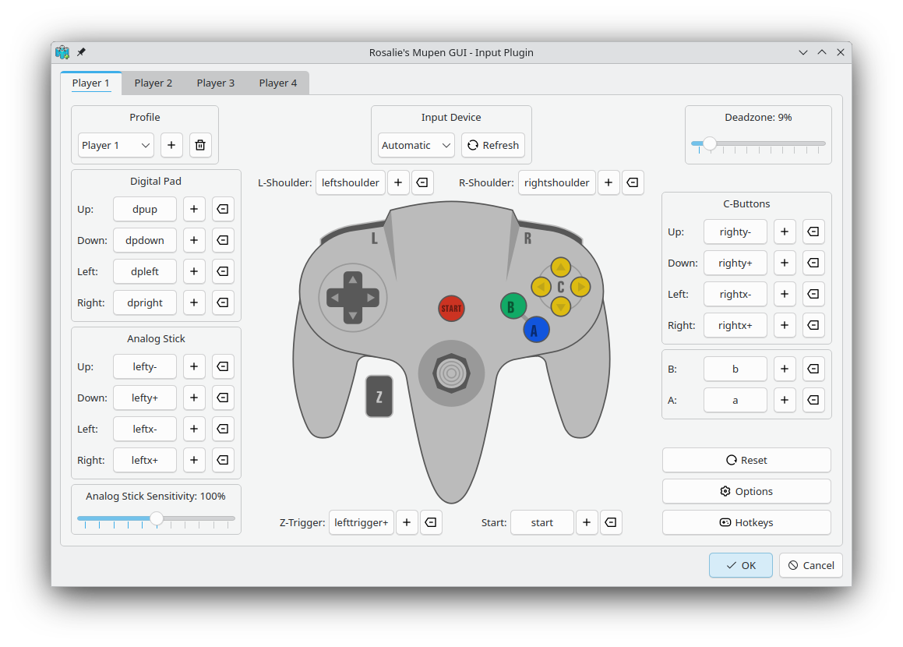

# Rosalie's Mupen GUI

Rosalie's Mupen GUI is a free and open-source mupen64plus front-end written in C++.

It offers a simple-to-use user interface.

## Download

#### Windows
You can download Rosalie's Mupen GUI on [Github Releases](https://github.com/Rosalie241/RMG/releases)

#### Linux
You can download Rosalie's Mupen GUI on 
* [Github Releases (AppImage)](https://github.com/Rosalie241/RMG/releases)
* [Flathub (Flatpak)](https://flathub.org/apps/details/com.github.Rosalie241.RMG)
* [Arch User Repository](https://aur.archlinux.org/packages/rmg)
* [Fedora COPR](https://copr.fedorainfracloud.org/coprs/rosalie/RMG/)

## Netplay

You can use netplay with the following methods:

### Port Forwarding

1) Download [rmg-netplay-server](https://github.com/Rosalie241/rmg-netplay-server/releases/latest)
2) Port forward the ports stated in the [rmg-netplay-server README](https://github.com/Rosalie241/rmg-netplay-server)
3) Create a JSON file with something similar to the following contents, but using your public IP instead of a local one:
```
{
  "some-server-name": "127.0.0.1"
}
```
If you want to add multiple servers instead:
```
{
  "some-server-name": "127.0.0.1",
  "some-server-name-2": "127.0.0.1"
}
```
4) Store the JSON file or upload it somewhere
5) Enter the JSON file path or URL in the "Server list URL" text box in the RMG settings dialog
6) The specified servers in the JSON file should appear in the RMG GUI


### Tunneling Software

1) Download [rmg-netplay-server](https://github.com/Rosalie241/rmg-netplay-server/releases/latest)
2) Download [Radmin VPN](https://www.radmin-vpn.com/)
3) Run and create or join a network in Radmin VPN
4) The host should run [rmg-netplay-server](https://github.com/Rosalie241/rmg-netplay-server)
5) The server should show up as `local-server` within the RMG GUI

## Support

You can ask for help or report issues on [Github](https://github.com/Rosalie241/RMG/issues/new)

## License

Rosalie's Mupen GUI is licensed under the [GNU General Public License v3.0](https://www.gnu.org/licenses/gpl-3.0.en.html).

## Showcase





## Building

#### Linux
* Portable Debian/Ubuntu

  ```bash
  sudo apt-get -y install cmake libusb-1.0-0-dev libhidapi-dev libsamplerate0-dev libspeex-dev libminizip-dev libsdl3-dev libfreetype6-dev libgl1-mesa-dev libglu1-mesa-dev pkg-config zlib1g-dev binutils-dev libspeexdsp-dev qt6-base-dev qt6-websockets-dev libqt6svg6-dev libvulkan-dev build-essential nasm git zip ninja-build
  ./Source/Script/Build.sh Release
  ```
  
* Portable Fedora
  ```bash
  sudo dnf install libusb1-devel hidapi-devel libsamplerate-devel minizip-compat-devel SDL3-devel freetype-devel mesa-libGL-devel mesa-libGLU-devel pkgconfig zlib-ng-devel binutils-devel speexdsp-devel qt6-qtbase-devel qt6-qtsvg-devel qt6-qtwebsockets-devel vulkan-devel gcc-c++ nasm git ninja-build
  ./Source/Script/Build.sh Release
  ```

* Portable Arch Linux
  ```bash
  sudo pacman -S --needed make cmake gcc libusb hidapi freetype2 libpng qt6 sdl3 libsamplerate nasm minizip pkgconf vulkan-headers git
  ./Source/Script/Build.sh Release
  ```

* Portable OpenSUSE Tumbleweed
  ```bash
  sudo zypper install SDL3-devel cmake freetype2-devel gcc gcc-c++ libusb-1_0-devel libhidapi-devel libhidapi-hidraw0 libpng16-devel libsamplerate-devel make nasm ninja pkgconf-pkg-config speex-devel vulkan-devel zlib-devel qt6-tools-devel qt6-opengl-devel qt6-widgets-devel qt6-svg-devel minizip-devel git
  ./Source/Script/Build.sh Release
  ```

When it's done building, executables can be found in `Bin/Release`

* Installation/Packaging
```bash
export src_dir="$(pwd)"
export build_dir="$(pwd)/build"
mkdir -p "$build_dir"
cmake -S "$src_dir" -B "$build_dir" -DCMAKE_BUILD_TYPE="Release" -DPORTABLE_INSTALL="OFF" -DCMAKE_INSTALL_PREFIX="/usr" -G "Ninja"
cmake --build "$build_dir"
cmake --install "$build_dir" --prefix="/usr"
```

#### Windows
* Download & Install [MSYS2](https://www.msys2.org/) (UCRT64)
```bash
pacman -S --needed make mingw-w64-ucrt-x86_64-cmake mingw-w64-ucrt-x86_64-gcc mingw-w64-ucrt-x86_64-libusb mingw-w64-ucrt-x86_64-hidapi mingw-w64-ucrt-x86_64-freetype mingw-w64-ucrt-x86_64-libpng mingw-w64-ucrt-x86_64-qt6 mingw-w64-ucrt-x86_64-sdl3 mingw-w64-ucrt-x86_64-speexdsp mingw-w64-ucrt-x86_64-libsamplerate mingw-w64-ucrt-x86_64-libusb mingw-w64-ucrt-x86_64-nasm mingw-w64-ucrt-x86_64-minizip mingw-w64-ucrt-x86_64-vulkan-headers git
./Source/Script/Build.sh Release
```

When it's done building, executables can be found in `Bin/Release`
