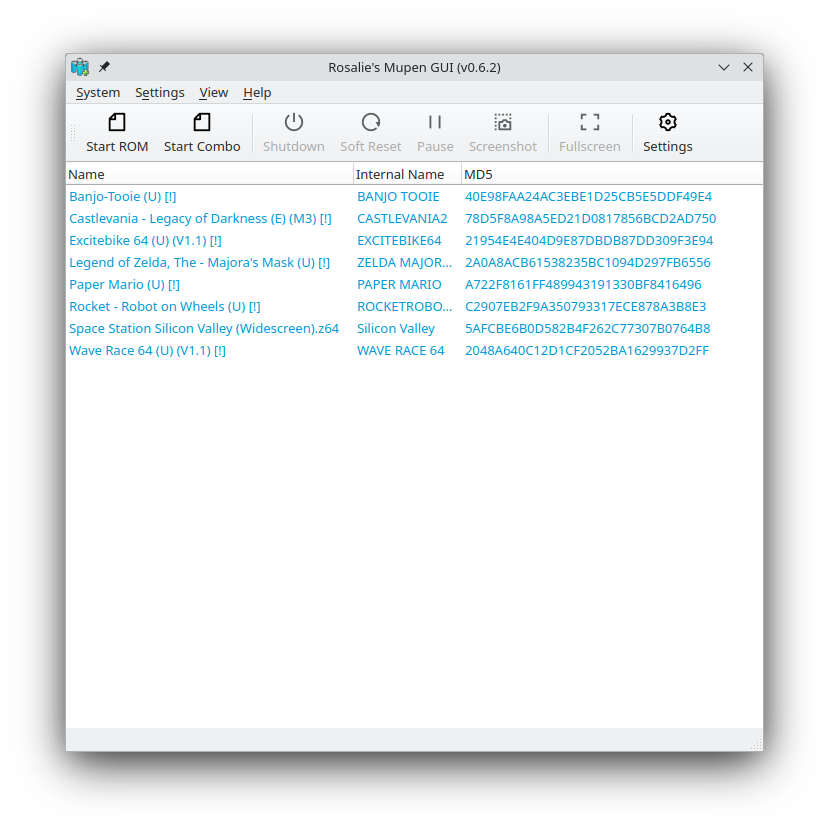

# Rosalie's Mupen GUI

Rosalie's Mupen GUI is a free and open-source mupen64plus front-end written in C++.

It offers a simple-to-use user interface.

## Download

#### Windows
You can download Rosalie's Mupen GUI on 

#### Linux
You can download Rosalie's Mupen GUI on 
* [Github Releases (AppImage)](https://github.com/Rosalie241/RMG/releases)
* [Flathub (Flatpak)](https://flathub.org/apps/details/com.github.Rosalie241.RMG)
* [Arch User Repository](https://aur.archlinux.org/packages/rmg)
* [Fedora COPR](https://copr.fedorainfracloud.org/coprs/rosalie/RMG/)

## Support

You can ask for help or report issues on
* [Github](https://github.com/Rosalie241/RMG/issues/new)
* [Discord](https://discord.gg/k9GuyJ2PpF)

## License

Rosalie's Mupen GUI is licensed under the [GNU General Public License v3.0](https://www.gnu.org/licenses/gpl-3.0.en.html).

## Showcase




## Building

#### Linux
* Portable Debian/Ubuntu

  ```bash
  sudo apt-get -y install cmake libhidapi-dev libsamplerate0-dev libspeex-dev libminizip-dev libsdl2-dev libfreetype6-dev libgl1-mesa-dev libglu1-mesa-dev pkg-config zlib1g-dev binutils-dev libspeexdsp-dev qt6-base-dev libqt6svg6-dev libvulkan-dev build-essential nasm git zip ninja-build
  ./Source/Script/Build.sh Release
  ```
  
* Portable Fedora
  ```bash
  sudo dnf install hidapi-devel libsamplerate-devel minizip-compat-devel SDL2-devel freetype-devel mesa-libGL-devel mesa-libGLU-devel pkgconfig zlib-ng-devel binutils-devel speexdsp-devel qt6-qtbase-devel qt6-qtsvg-devel vulkan-devel gcc-c++ nasm git ninja-build
  ./Source/Script/Build.sh Release
  ```

* Portable Arch Linux
  ```bash
  sudo pacman -S --needed make cmake gcc hidapi freetype2 libpng qt6 sdl2 libsamplerate nasm minizip pkgconf vulkan-headers git
  ./Source/Script/Build.sh Release
  ```

* Portable OpenSUSE Tumbleweed
  ```bash
  sudo zypper install SDL2-devel cmake freetype2-devel gcc gcc-c++ libhidapi-devel libhidapi-hidraw0 libpng16-devel libsamplerate-devel make nasm ninja pkgconf-pkg-config speex-devel vulkan-devel zlib-devel qt6-tools-devel qt6-opengl-devel qt6-widgets-devel qt6-svg-devel minizip-devel git
  ./Source/Script/Build.sh Release
  ```

When it's done building, executables can be found in `Bin/Release`

* Installation/Packaging
```bash
export src_dir="$(pwd)"
export build_dir="$(pwd)/build"
mkdir -p "$build_dir"
cmake -S "$src_dir" -B "$build_dir" -DCMAKE_BUILD_TYPE="Release" -DPORTABLE_INSTALL="OFF" -DCMAKE_INSTALL_PREFIX="/usr" -G "Ninja"
cmake --build "$build_dir"
cmake --install "$build_dir" --prefix="/usr"
```

#### Windows
* Download & Install [MSYS2](https://www.msys2.org/)
```bash
pacman -S --needed make mingw-w64-x86_64-cmake mingw-w64-x86_64-gcc mingw-w64-x86_64-hidapi mingw-w64-x86_64-freetype mingw-w64-x86_64-libpng mingw-w64-x86_64-qt6 mingw-w64-x86_64-SDL2 mingw-w64-x86_64-speexdsp mingw-w64-x86_64-libsamplerate mingw-w64-x86_64-nasm mingw-w64-x86_64-minizip mingw-w64-x86_64-vulkan-headers git
./Source/Script/Build.sh Release
```

When it's done building, executables can be found in `Bin/Release`
